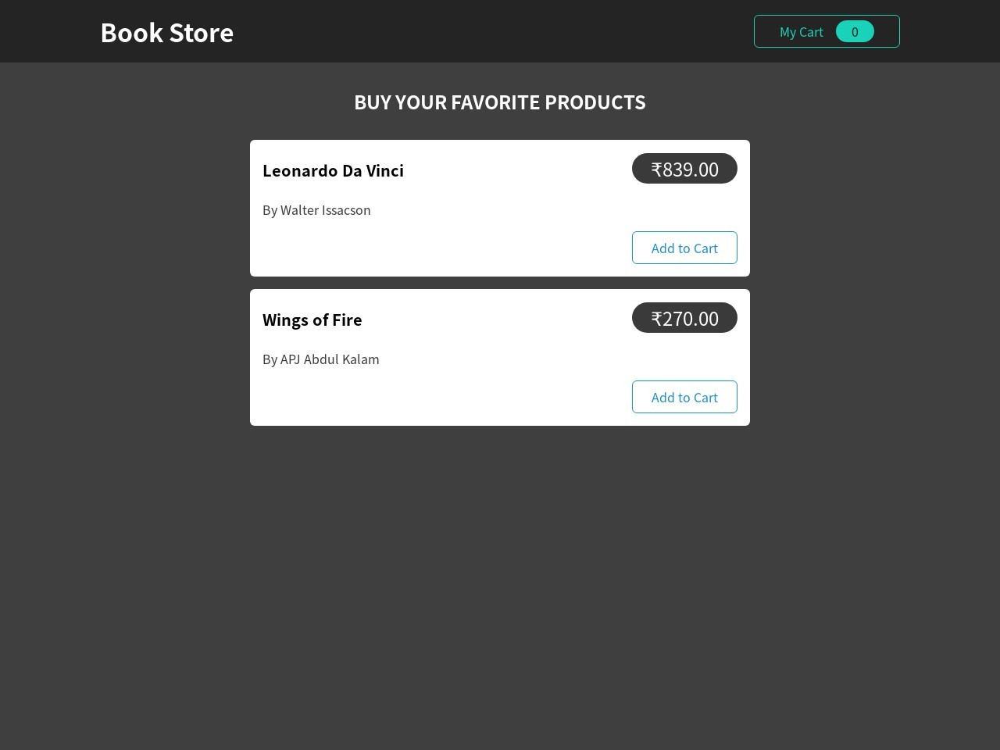

# Book Store



## Demo

[View Demo](https://reactbookstoreapp.web.app/)

## About The Project

Book Store is an application built using
React JS and uses firebase as a dummy backend to send/receive the Book cart data
. This app uses modern React Hooks such as
useDispatch, useSelector
. This application was
built using Redux toolkit for global state management and Action Creator
Thunk for sending/fetching data.
The user can add required books to the cart
,view and remove them in cart section, cart updates in realtime.

## Built Using

Book Store is built with React JS along with HTML and CSS.
It uses Redux for global state management
Thunk for managing side effects, NPM as package manager and firebase
as dummy backened

- React Hooks
- HTML
- CSS
- NPM
- Redux and Thunk

## Getting Started

To get started with project just simply fork this repo or download locally on your System.

## Prerequisites

Start with the latest version of NPM to avoid any errors:

```bash
  npm install npm@latest -g
```

## Installation and Deployment

1). Get a firebase account, set up the project add the Book data (name,author,price etc) on the firebase and and get the project URL.

2). Open cart-actions.js and replace the link in fetchCartData
function with
the link from firebase and adding "/cart.json" at the end of link.

3). In cart-actions.js and replace the link in the sendRequest function
with
the link from firebase and adding "/cart.json" at the end of link.

4). On the firebase console go to hosting and follow the necessary steps by running
commands in the terminal.

5). After successfully executing the firebase commands use the obtained link to access the app

## Available Scripts

In the project directory, you can run:

```bash
 npm start
```

Runs the app in the development mode.
Open http://localhost:3000 to view it in your browser.

```bash
npm run build
```

Builds the app for production to the build folder.
It correctly bundles React in production mode and optimizes the build for the best performance.

The build is minified uses only necessary files, the filenames include the hashes.
Your app is ready to be deployed!

## Usage

- Book Store allows users to Add/Remove books to cart and sending cart data to backend
- Users can add their desired books, change quantity as well as remove the books
- Users can toggle cart to view and hide their books.
